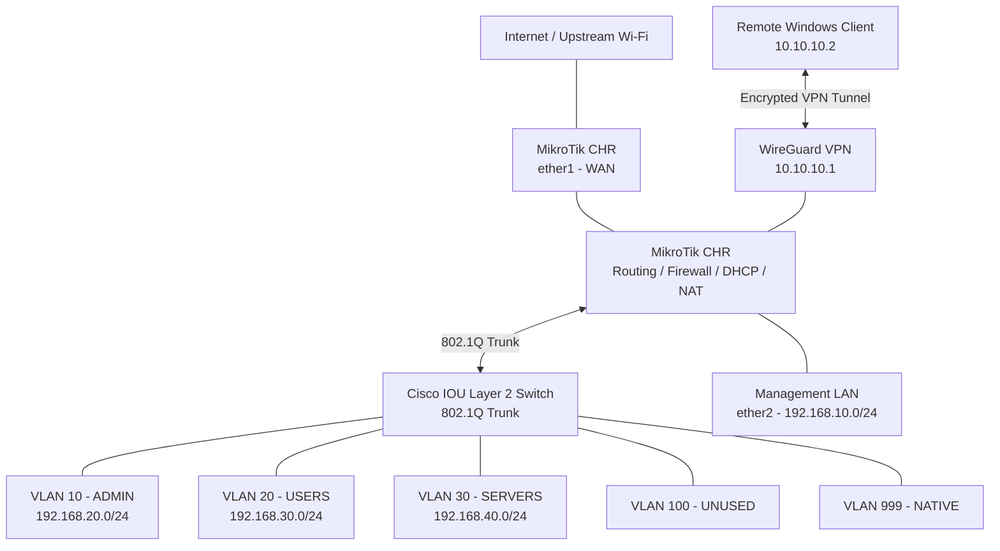

# Network Topology Diagram

```mermaid
flowchart TB
    INTERNET["Internet / Upstream Wi-Fi"]
    WAN["MikroTik CHR<br/>ether1 - WAN"]
    ROUTER["MikroTik CHR<br/>Routing / Firewall / DHCP / NAT"]
    SWITCH["Cisco IOU Layer 2 Switch<br/>802.1Q Trunk"]

    ADMIN["VLAN 10 - ADMIN<br/>192.168.20.0/24"]
    USERS["VLAN 20 - USERS<br/>192.168.30.0/24"]
    SERVERS["VLAN 30 - SERVERS<br/>192.168.40.0/24"]
    UNUSED["VLAN 100 - UNUSED"]
    NATIVE["VLAN 999 - NATIVE"]

    MGMT["Management LAN<br/>ether2 - 192.168.10.0/24"]

    VPN["Remote Windows Client<br/>10.10.10.2"]
    WG["WireGuard VPN<br/>10.10.10.1"]

    INTERNET --- WAN
    WAN --- ROUTER
    ROUTER <-->|"802.1Q Trunk"| SWITCH

    SWITCH --- ADMIN
    SWITCH --- USERS
    SWITCH --- SERVERS
    SWITCH --- UNUSED
    SWITCH --- NATIVE

    ROUTER --- MGMT
    VPN <-->|"Encrypted VPN Tunnel"| WG
    WG --- ROUTER
```
