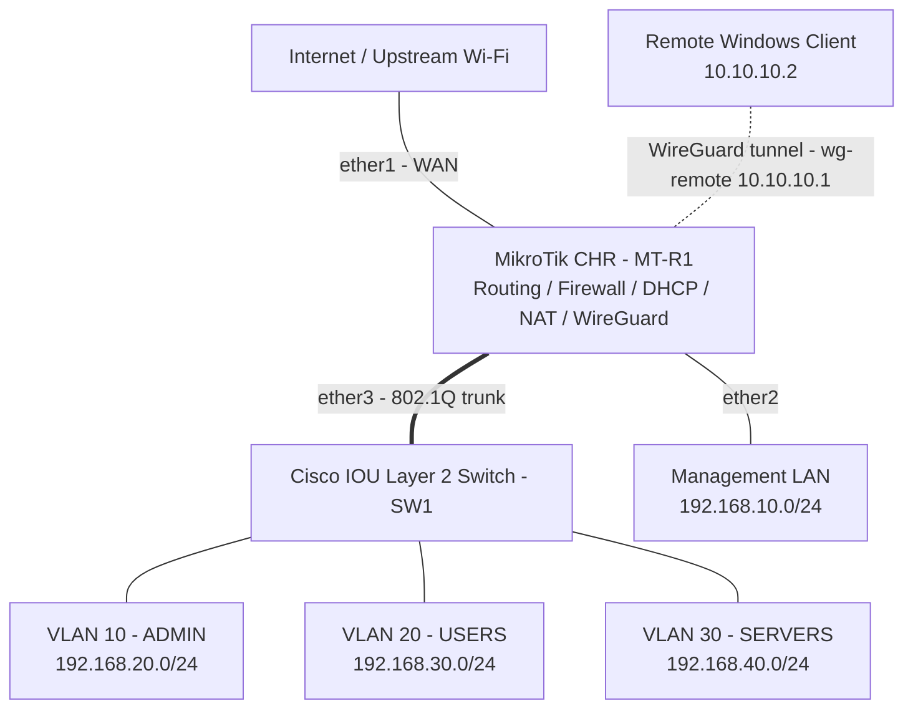

# Network Topology Diagram

```mermaid
flowchart TB
    INTERNET["Internet / Upstream Wi-Fi"]
    ROUTER["MikroTik CHR - MT-R1<br/>Routing / Firewall / DHCP / NAT / WireGuard"]
    SWITCH["Cisco IOU Layer 2 Switch - SW1"]
    MGMT["Management LAN<br/>192.168.10.0/24"]
    ADMIN["VLAN 10 - ADMIN<br/>192.168.20.0/24"]
    USERS["VLAN 20 - USERS<br/>192.168.30.0/24"]
    SERVERS["VLAN 30 - SERVERS<br/>192.168.40.0/24"]
    VPN["Remote Windows Client<br/>10.10.10.2"]

    INTERNET ---|"ether1 - WAN"| ROUTER
    ROUTER ---|"ether2"| MGMT
    ROUTER ===|"ether3 - 802.1Q trunk"| SWITCH
    SWITCH --- ADMIN
    SWITCH --- USERS
    SWITCH --- SERVERS
    VPN -.-|"WireGuard tunnel - wg-remote 10.10.10.1"| ROUTER
```
